# 校色仪怎么用捏
## 写在前面
万能的科服抖了抖c223工具箱，掉出来一台校色仪。
没错！科服开始提供校色服务了，有需求的同学可以在每晚7点-10点来到c224为你的屏幕校色。

# 使用SpyderX配套软件进行校准

## 一些准备

### 环境准备

1. 校色开始前显示器应**开机最少30分钟**

2. 在开始校色前，确保没有光线直射在显示器面板表面（**关灯**啦）
3. 如可能的话，将显示器重置为工厂默认设置
4. 关闭显示器上所有的**自动亮度调整**功能
5. 用擦镜布把显示器表面擦干净，防止你平时留下的指纹影响校色效果

### 下载配套软件 

#### 从Datacolor网站下载SpyderX

网站链接为[Activate your SpyderX Display Calibration Tool | Datacolor (datacolorchina.cn)](https://spyderx.datacolorchina.cn/zh-hans/activate/)。科服提供的校色仪为SpyderX 红蜘蛛，请下载配套软件。

#### 从科服nas下载SpyderX（仅科服队员）

登陆nas账号后，在share/应用软件/非校园提供/spyderx校色中下载。

### 软件激活

1. 首先，确保校色仪已插入电脑 USB 口，最好用直插端口，而不要用集线器或延长线，USB 口需要给校色仪供电。
2. 输入系列号（系列号位于盒子底部，科服校色仪的系列号见下）
   - 系列号：2E8A32-41B56D-BC42
3. 电脑联网后，选择“Activate Using the Internet(suggested)“进行自动激活
4. 填写信息并选择是否希望通过电子邮件接收更新和降价信息
   - 姓名：haomeng wang
   - 电子邮箱：chang_yun@outlook.com
   - 确认邮箱同上

## 校色步骤

软件向导会一步步引导您完成这个过程，软件界面右边存在交互式帮助，可描述软件中界面每个功能

### 工作流程选择
选择校准显示器或软打样/设备模拟，一般均选择第一项

### 欢迎页面

有 4 个需要勾选的选项，是软件对于初次使用者的提示：

- 预热：校准开始前请确保显示器开机至少 30 分钟
- 环境光照：请确保没有光源直射显示器，因为这可能会对校色产生影响
- 显示器控制：如果显示器有这些控制选项，请确保设置为默认或等效出厂设置
- 校色仪连接：确保校色仪已插入计算机的 USB 口，最好用直插端口，而不要用集线器或延长线，否则可能因供电不足导致校色出错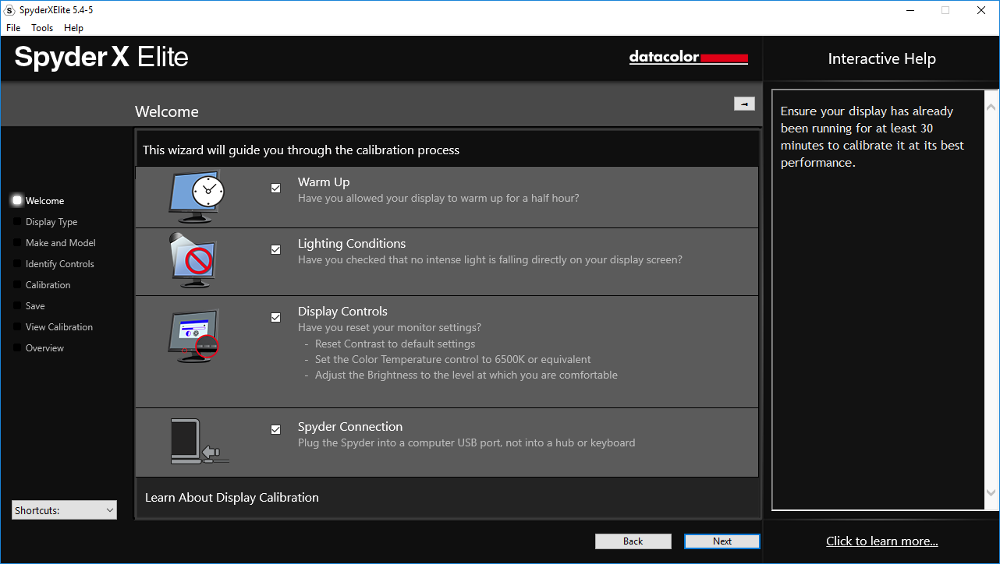

### 显示器选择

如果有多个显示器连接到计算机，则可以在此下拉菜单中选择要校准的显示器。该软件将自动显示于选定的显示器以运行校准。

### 显示器类型

选择桌面显示器或笔记本电脑屏幕

### 显示器制造商型号

选择显示器的制造商并输入显示器型号

### 控制识别

选择显示器自身是否有亮度和色温控制的硬件控制设置

- 对于笔记本，可以自行在电脑设置中查看是否可控制色温（并把预设调节至标准，色温调节到6500K）
- 对于外界显示器，一般亮度和色温控制都需要勾选

### 显示器技术

选择显示器的背光类型。具体背光类型介绍在软件界面上有显示。

>如何了解自己的显示器使用的技术？{is-info}

#### 笔记本屏幕
您可以通过AIDA64软件来查看自己显示器的具体参数，包括显示器的型号、制造商、背光类型、色彩空间等等。点击[这里](https://www.aida64.com/downloads)下载AIDA64软件，安装后打开软件，点击左侧的“计算器”选项卡，然后点击“显示设备”选项卡，再点击“显示器”选项卡，就可以看到显示器的具体参数了。
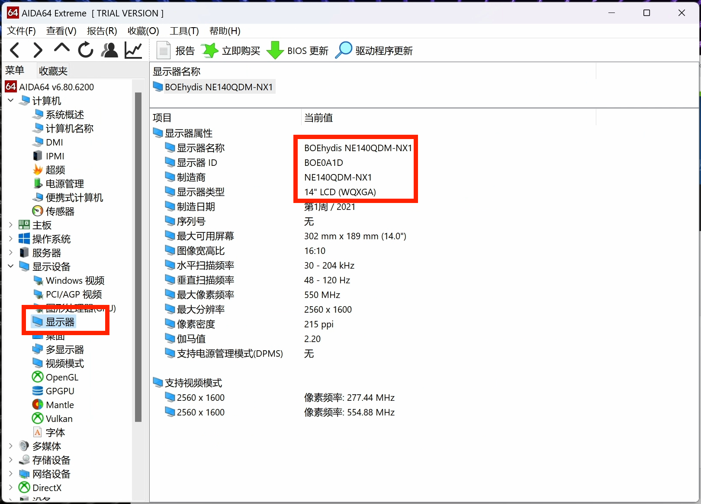

以笔者的2022款幻14为例，如图可以看出这是一块来自BOE的14英寸IPS显示器，背光类型为LED。
显示器具体名称为BOEhydis NE140QDM-NX1。

我们在浏览器中输入 https://panelook.cn，输入"NE140QDM-NX1"并查询，就可以查看到显示器的具体参数了。
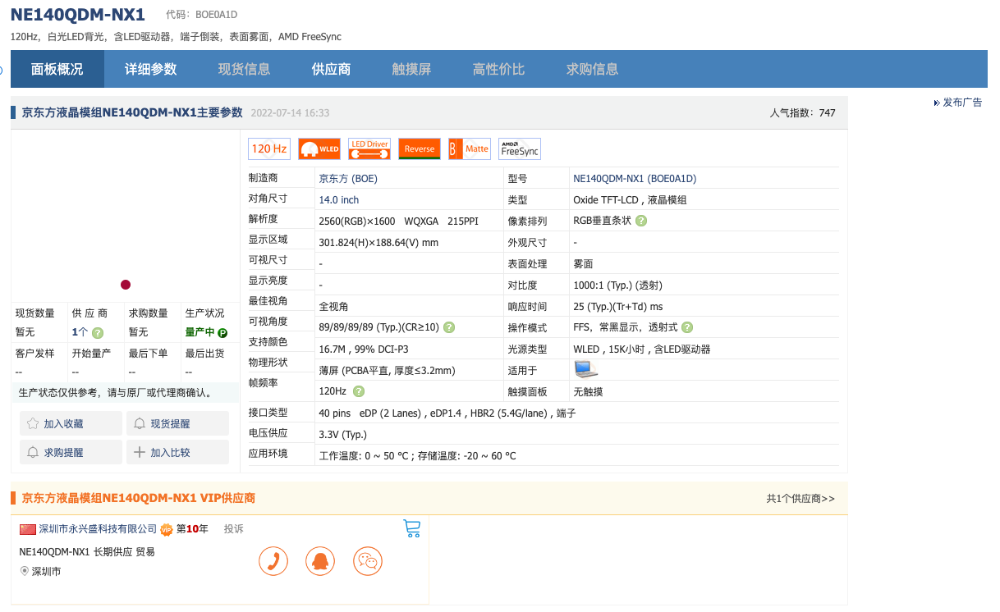

#### 外接显示器
对于外界显示器，可以在浏览器中输入 https://www.displayspecifications.com/en 在右上角的搜索栏中输入自己的显示器的型号，便可以进行查询。

在笔记本的设置中可以在显示器一栏中看到外接屏幕的型号，如图所示。

以笔者的显示器为例，型号为DELL U2715H，输入型号并查询，就可以看到显示器的具体参数了。

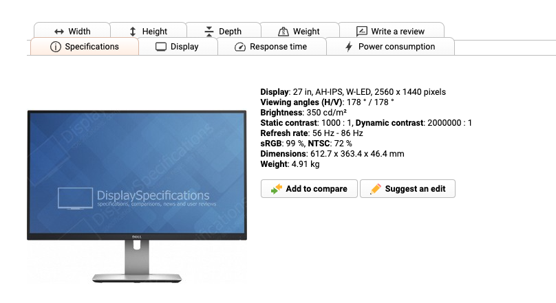
### **选择工作流程** 

选择要使用的校准模式，一般选择第一项即可，以下仅给出“渐进式助手”的流程

- 渐进式助手——软件助手将引导过程的每一步。 
- 工作室匹配——尽可能匹配工作室的所有显示器。 
- 专家控制台——在一个界面内提供所有可设置的参数。

### **渐进式助手** 

如果这是首次校准此显示器，此处会自动选择完全校准。总共三个选项可选，分别是完全校准、重新校准、校准检查。重新校准是用于定期重新校准，校准检查是检查显示器是否仍然准确。

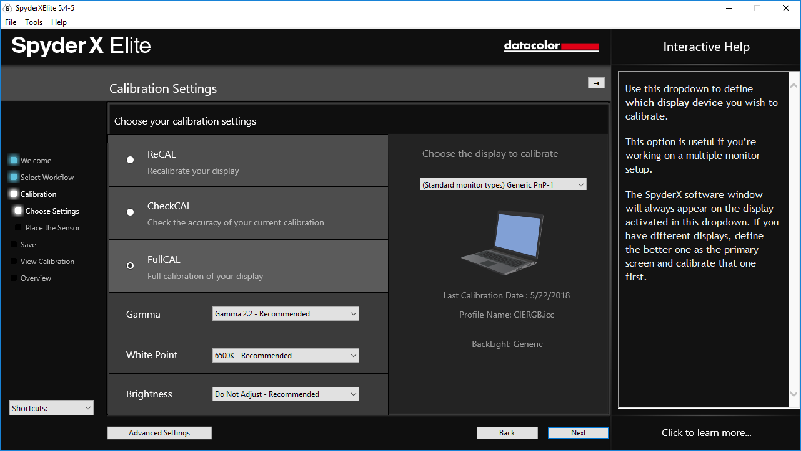

可以在此设置色温和亮度值。

左下角有有一个“高级设置“按钮。

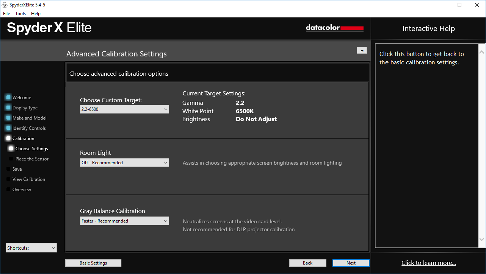

- 可以自定义目标参数。
- 选择是否让校色仪读取环境光，以帮助设置显示器的亮度。如果需要读取房间的环境光，可以选择在检测到环境光更改时通知并建议进行新的校准，或者使用自动切换。自动切换可以创建多个配置文件，并在环境光改变时自行切换。 
- 灰度平衡校准。有更好、更快（推荐）和关闭三个选项。更好是做一个迭代灰度平衡，会花费时间更久，但校准结果更准。更快将只执行校准所需的最小灰度级别测量。关闭，仅在校准前投式投影仪时使用。

### **校色**

如果前面选择了室内光照打开或自动设置，会弹出一个对话框，要求在校色开始前调整好亮度。 

此处显示如何放置校色仪的位置。打开传感器的保护盖，作为配重保持在合适的位置上，并放置校色仪在所示位置。建议稍微向后倾斜显示器，这样校色仪可以紧贴显示器，不要在校色过程中移动校色仪，否则可能导致出错。

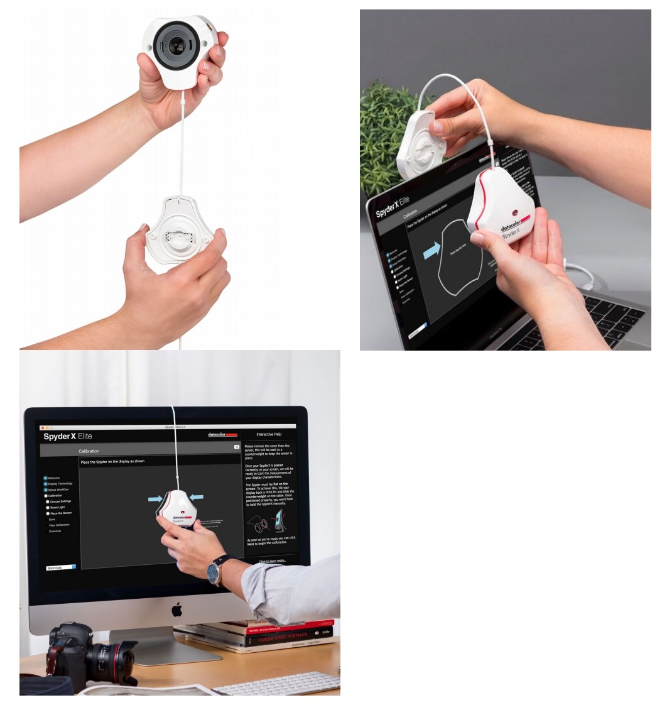

校色仪就位后，单击“下一步”进行校准。屏幕上会出现一系列色彩标定，这一过程大概需要2-3分钟。 

如果您选择了亮度水平调整或自动，校色过程会中间停止，并要求您调整您的显示器亮度到建议的水平。调整完成后，点击“更新”按钮，校色仪会再次检查亮度水平，看是否接近理想的亮度设置。

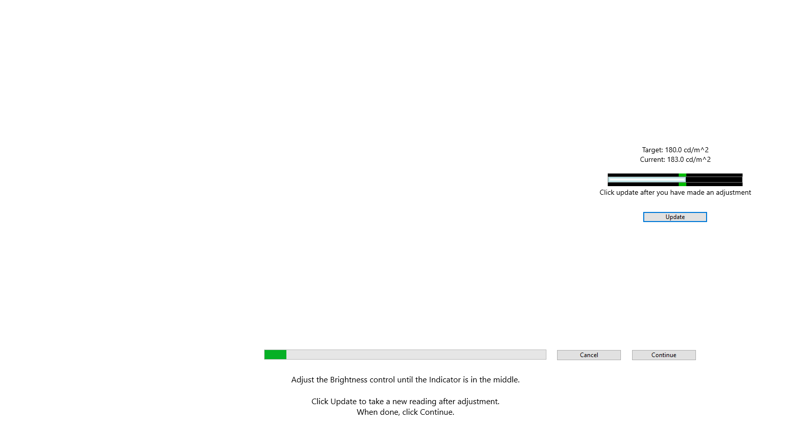

在亮度指示的绿色区间内时，可以按下“继续”按钮。这之前可能需要反复调整几次显示器的亮度，请尽量接近目标，虽然它可能不会完全跟预设亮度值一致，但只要在误差允许的绿色范围内就可以。 

### **保存配置文件**

当校色完成后，保存文件窗口

输入配置文件名。下面是一个我们认为比较好的示例： 

“Model_yyyymmdd(date)_ver1” 

即：XXXX_20190216_ver1 

(显示器型号\_日期\_色彩版本) （这里怎么让它不斜体啊）

建议不要使用中文否则可能导致调用特性文件出错。 

您还可以设置醒您何时重新校色，官方建议每2周一次。 

### **重新校准** 

在进行完全校准后，可以重新校准，这个过程更为省时且不需要重新设置。从重新校准窗口中选择后，会以已经设置好的参数进行校准。 （只有完成完全校准后，才能进行重新校准。 ）

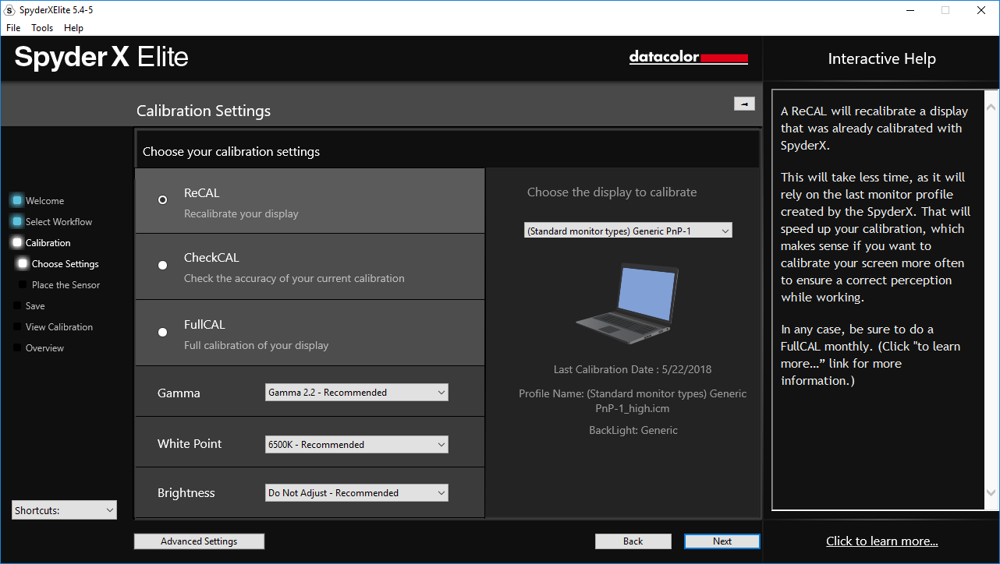

### **一键校准** 

可以使用快捷校准方法辅助进行校准。单击任务栏/系统托盘中的图标，选择想要校准的显示器，像往常一样完成校准过程。 

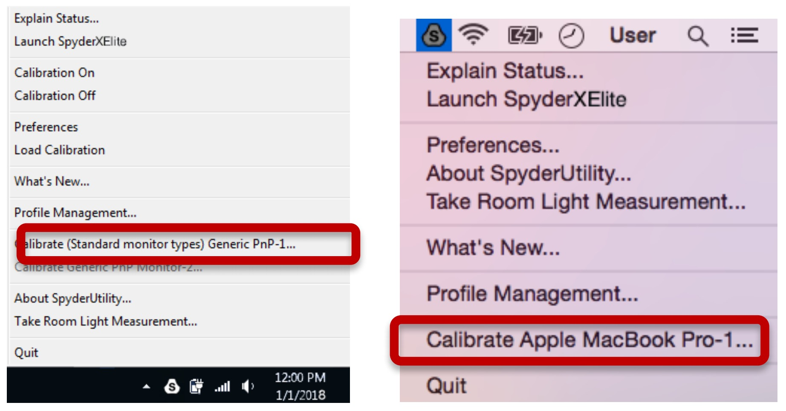

### **校准检查** 

快速检验您的显示器是否需要重新校准：

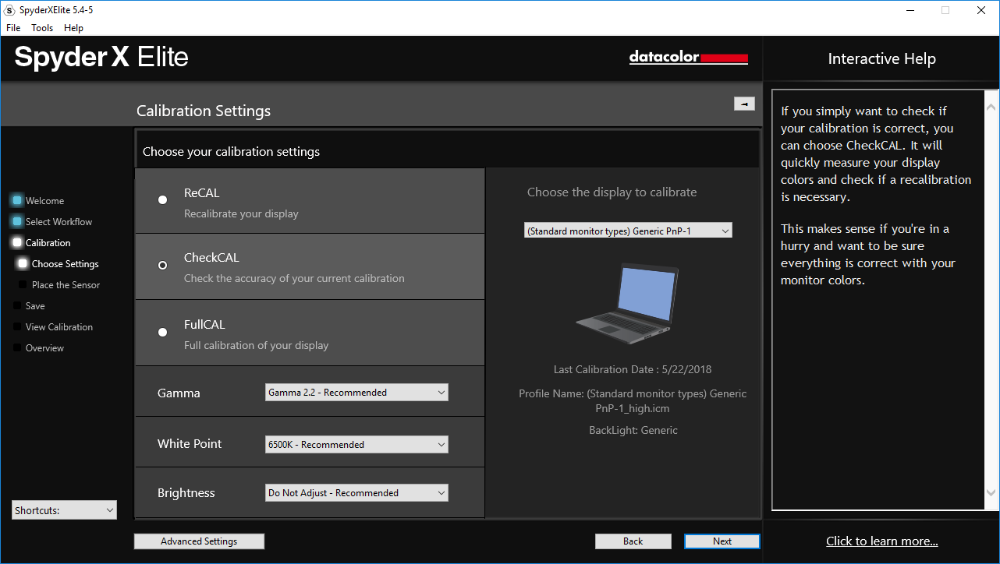

使用少量的色标测量，或其他测量来知道是否需要重新进行校色。 

### **校色前后对比**

点击“切换”来查看比较校色前后的效果。

在图像上点击以放大图像，获得更多更详细的图像细节，针对校色前后对比。 

在底部有一个下拉式菜单，可以选择使用默认图像的标准集或自定义图像来查看。也可以单击“自定义”按钮来选择图像，甚至可以拖放图像到窗口显示。支持使用JPEG格式或TIFF格式。 

还可以通过点击左下角的“全屏”查看全屏图像。 

### **配置文件预览** 

此处可以看到当前显示器的色域，并与行业标准色域进行对比。也可以选择此前生成的配置文件进行对比。 

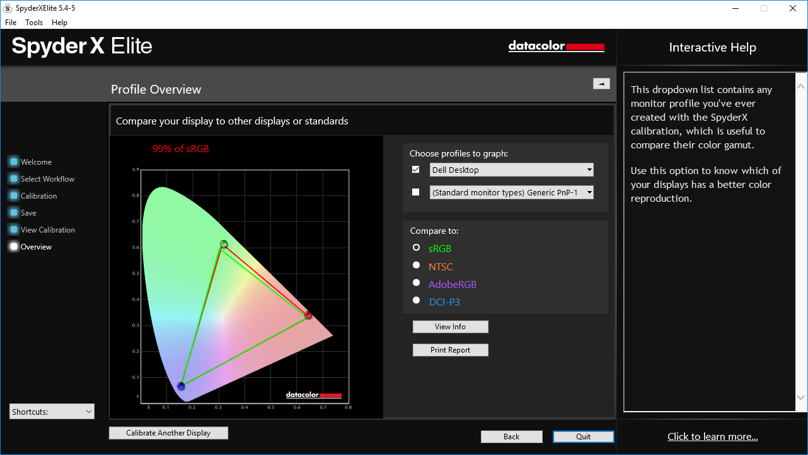

完成后，可以点击退出。或校准另一台连接到此计算机的显示器。 

## **管理色彩ICC文件**
ICC文件，即ICC色彩配置文件，是一种用于描述显示设备的色彩特性的文件。ICC文件包含了显示设备的色彩特性，如色彩空间、色彩深度、色彩渲染、色彩校正等。

在你使用spyderx矫正屏幕色彩后，spyderx会自动将矫正后的色彩特性保存为ICC文件，这个ICC文件就是spyderx的色彩配置文件。

当然，你可以选择不同的ICC文件来匹配自己的喜好与需求，这时你就需要在Windows系统中管理ICC文件了。

打开设置，选择显示，点击高级显示设置，选择显示器选项卡，点击颜色管理，点击添加，选择你想要的ICC文件，点击打开，点击确定，点击应用，点击确定，即可应用这个ICC文件

# 使用DisplayCAL校准显示器并测量色彩

## 关于DisplayCAL
DisplayCAL是一个开源的显示器校准软件，它可以校准显示器的色彩，测量显示器的色彩，生成ICC配置文件，以及校准打印机。

## 下载DisplayCAL
DisplayCAL的官方网站是：https://www.displaycal.net/
你可以访问这个网站，下载DisplayCAL的最新安装包，请选择适合你的操作系统的安装包。

## 安装DisplayCAL
安装DisplayCAL非常简单，直接双击安装包，按照提示安装即可。

安装完成后，默认情况下会自动打开DisplayCAL，如果没有自动打开，你通过快捷菜单中的DisplayCAL的快捷方式打开。

>注意，首次打开时，DisplayCAL会弹出系统未安装ArgyllCMS的提示，这是因为DisplayCAL依赖于ArgyllCMS，所以需要安装ArgyllCMS，你需点击“Download”按钮，下载ArgyllCMS的安装包，然后安装ArgyllCMS。
{.is-warning}
## 
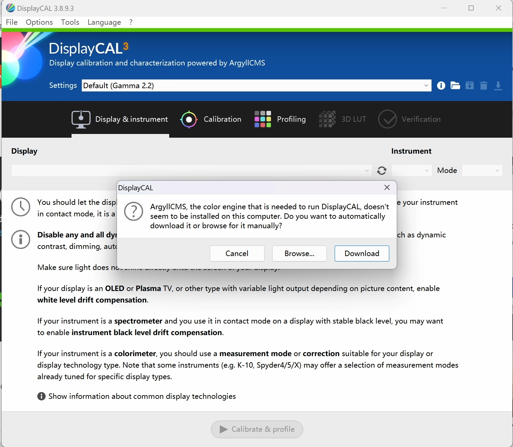

由于网络速度比较慢，所以你可能需要等待一段时间，等待ArgyllCMS安装完成。

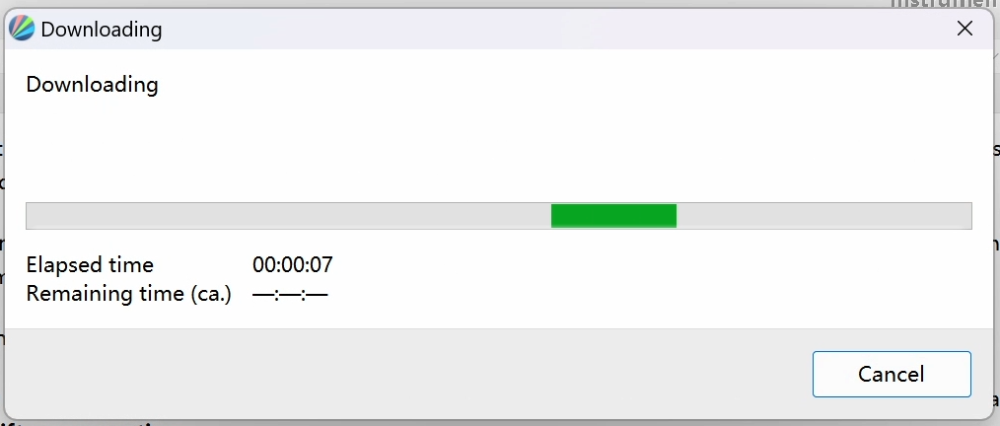
（别心急关了，不然自己手动baidu教程安装吧嘻嘻）

此时可以在上面的Language下拉菜单选择“简体中文”，你的DisplayCAL就会切换为中文界面。

## 校准屏幕并测量色彩

1. 点击上边菜单栏中“工具”——“报告”———“未校准显示设备报告”，等待报告出来后记下“Aprox. gamma=” 后面的数字。

2. 选择“显示器&校色仪”选项卡，点击“校色仪”按钮，选择“SpyderX”，测量模式根据你的显示器类型进行选择。显示器类型的判断在前文“显示器技术”中有详细介绍。

请勾选“黑电平漂移补偿”选项。
3. 选择“校准”选项卡，在色调曲线的伽马值下拉菜单中选择和前文记录最近的gamma值。
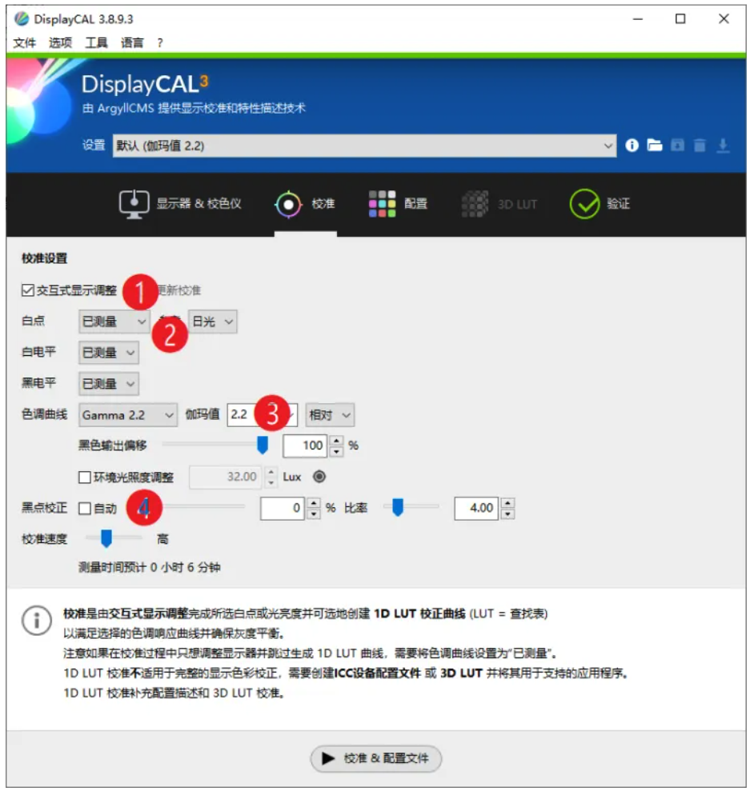
4. 点击最下方“校准&配置文件”按钮，坐和放宽，等待校准完成。

如图，可以看出显示器的色准和色域，当平均$\Delta E$值小于2时，显示器的色彩就可以接受了。
你可以选择是否安装色彩配置文件。

大功告成，现在你的显示器已经完成了校准！
# 说在后面

本教程SpyderX部分结合官方用户指南，针对科服所采用的校色仪型号进行调整和补充。整体的软件引导比较清晰，所以或许你不会看到这里（x

后半部分Displaycal的部分参考了知乎文章[Argyll CMS+DisplayCAL屏幕校色基础教程](https://zhuanlan.zhihu.com/p/324208793)

本文由方文昊和刘雨琳合作完成