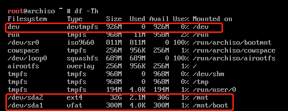
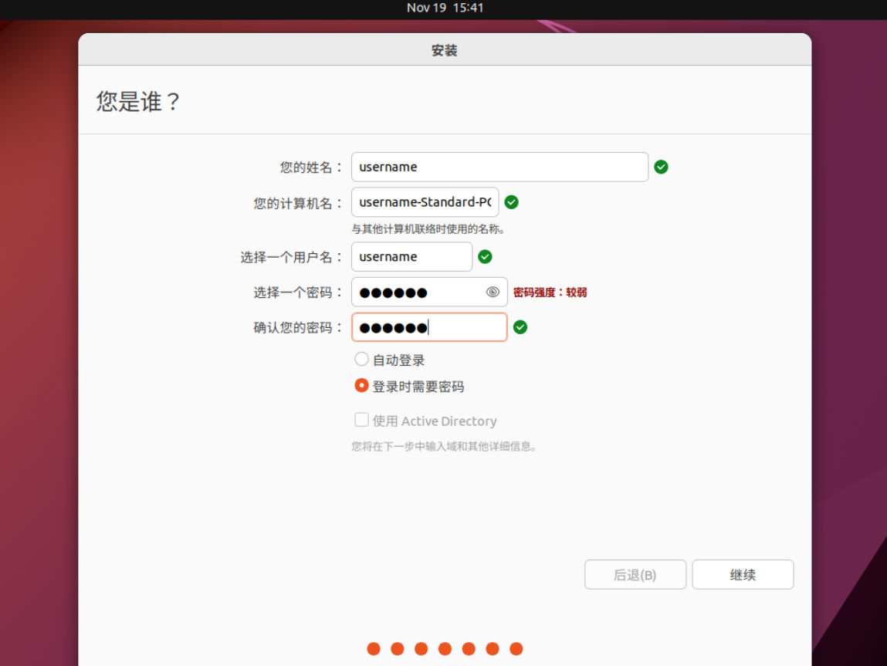
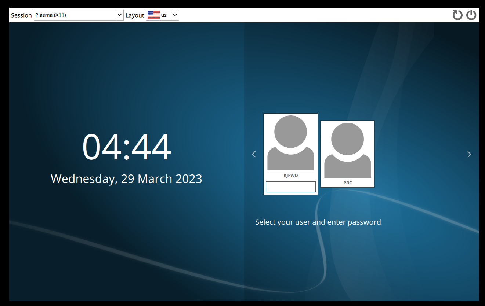
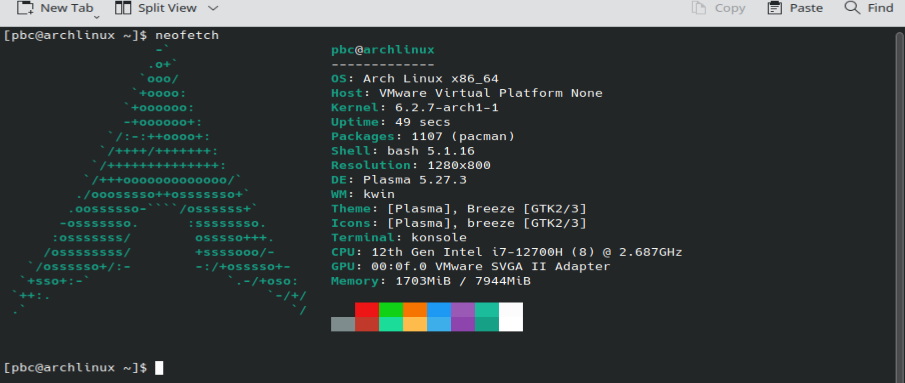

# 从0开始你的Arch Linux之旅

## 关于Arch Linux

Arch Linux 是一个独立开发的 x86-64 通用 GNU/Linux 发行版，和Ubuntu、Debian等比较耳熟能详的发行版不同，Arch Linux保持着高度的多样性，在安装时只提供了一个命令行界面，用户可以通过在官方存储库中提供的数千个高质量软件包中进行选择来构建自定义系统，避免了存储空间和捉紧和安装软件的冗余。

| 安装包                              | 大小      |
| ----------------------------------- | --------- |
| **archlinux-2023.03.01-x86_64.iso** | **810MB** |
| ubuntu-20.04.5-desktop-amd64.iso    | 3.59GB    |
| ubuntu-22.10-desktop-amd64.iso      | 3.79GB    |

## 启动操作系统

由于安装Arch Linux只提供了一个命令行界面，我们需要了解一台计算机加载操作系统并启动的过程，来进一步明确在安装过程中每一步的目的。

启动过程分为六步：

1. **ROM(read-only memory)** 将 **BIOS(basic input/output system)** 装载入内存后，启动程序开始运行并控制硬件。
2. BIOS执行**POST（The Power-On-Self-Test）**，即开机自检，来检查输入/输出的可操作性。如果检测出现问题，电脑就会发出 “bee---” 的声响（相信科服的朋友线下值班的时候都遇见过这种怪叫的笔记本）。
3. BIOS寻找**操作系统（OS）**，搜索信息存放在CMOS中（每次去除静电都要拔下来的那个小电池），在此过程中，操作系统内核也被加载进内存中。随后，操作系统开始支配电脑并加载系统配置信息。
4. 系统配置，加载外围设备和驱动程序。
5. 加载系统管理程序。
6. 用户登录，开始交互。

Ref: <https://www.nielit.gov.in/gorakhpur/sites/default/files/Gorakhpur/OLEVEL_ICT_2_26Mar_RP.pdf>

## BootLoader

上面说到计算机首先执行ROM中的一个相对较小的程序以及一些需要的数据，初始化 CPU 和主板，初始化内存并将操作系统中的程序和数据加载到 RAM 中的设备。启动这一系列操作的小程序就叫**BootLoader**。

在计算机中，大致分为两阶段引导加载过程：

+ First-Stage BootLoader：例如BIOS、**UEFI** （**U**nified **E**xtensible **F**irmware **I**nterface）
+ Second-Stage BootLoader：例如在笔记本上常见的GNU GRUB（很多来装双系统的同学或队员在笔记本的启动界面会看到他）。它们本身不是操作系统，但能够正确加载操作系统并将执行转移给它。第二阶段引导加载程序不需要驱动程序来运行，而是可以使用系统固件提供的通用存储访问方法，例如 BIOS、UEFI 。

## 分区与挂载

挂载点（**mount point**）是一个文件系统中的文件夹，可以逻辑上链接到另一个文件系统，是大多数与**便携式操作系统**（也就是我们的装机盘）接口兼容的操作系统运行的基础。挂载命令（**mount**）用来让我们的系统访问到其他设备或文件系统，并将系统根目录与挂载点连接。

在Linux系统中，有两个默认的便携式设备的挂载点位置：**/dev**：挂载物理设备，和**/mnt**：挂载便携式设备或临时文件系统。对应的概念也可以在[FHS: Filesystem Hierarchy Standard](https://en.wikipedia.org/wiki/Filesystem_Hierarchy_Standard)中查阅到。

在Linux下，系统分区（**system partition**）和引导分区（**boot partition**）十分重要。引导分区存放着bootloader，负责启动操作系统，通常挂载在 /boot/ 下；系统分区则包含了操作系统的文件夹，即所谓的根目录 / 。

Ref:https://en.wikipedia.org/wiki/System_partition_and_boot_partition


有了如上的基本了解，我们可以在USB中下载好Arch Linux镜像，安装一个属于自己的Arch Linux啦！

## Installation Guide

**安装过程请确保已连接有线网**。这次我们选择UEFI。Security Boot已经是老生常谈了，从USB中导入后进入我们的安装系统（为了可以重复安装这里使用虚拟机来演示）：


首先查看磁盘状态：

```bash
fdisk -l
```

系统输出类似于：


从上面可以看到，总扇区有67108864个（如果你使用过Disk Genius 来扫描坏道的话是可以看到若干扇区的），每个扇区大小为512bytes，相乘恰好为34359738368。

接下来对磁盘进行分区：

```bash
fdisk /dev/sda
```

先按“g”，表示使用GPT格式创建分区，**对应UEFI引导**（mark 亲测如果忽略了这步后面可能不成功）；“p”查看分区状态。

-2023-03-29-11-58-05.png)

分区后效果：

-2023-03-29-11-58-051.png)

当然，如果你不习惯fdisk的操作，也可以：

```bash
cfdisk /dev/sda
```


这里/dev/sda1拟用作引导分区，/dev/sda2拟用作系统分区（见**分区与挂载**）。

随后，为分区创建文件格式：

```bash
mkfs.vfat -F 32 /dev/sda1 # 引导分区
mkfs.ext4 /dev/sda2      # 系统分区
```

因为这里我们使用UEFI引导，故引导分区文件格式为FAT32；ext4为Linux下经典的文件格式（参考Windows系统磁盘管理上方NTFS文件格式）。

对比Ubuntu（见下图），可以看到 Ubuntu 自动分析了当前磁盘状况，决定把自己安装到/dev/nvme0n1 这块盘的 partition 5，并将其格式化为 ext4 格式。


挂载操作：

```bash
mount /dev/sda2 /mnt
mount --mkdir /dev/sda1 /mnt/boot
```

这里一定要先挂载系统分区，再挂载引导分区，并注意磁盘分区大小（前几次安装失败都是因为挂载点出错）。

查看分区类型：

```bash
df -Th
```



首先我们的引导分区和系统分区的文件格式正确，而且注意Mount on列，/dev被自动挂载到/dev下，而前两个分区按照之前的操作被挂载到相应的目录下，即意味着我可以在 /mnt 下访问到 /dev/sda2下的数据，/mnt/boot 同理。

挂载成功后，就可以开始我们的安装，但是在安装之前，像conda、pip换源一样，Arch Linux的安装包也可以从国内找到开源库，以提高下载速度。

```bash
vim /etc/pacman.d/mirrorlist # vim-文本编辑器 pacman-Arch Linux包管理器 /etc-配置文件目录
```

添加tuna源：

```bash
Server = https://mirrors.tuna.tsinghua.edu.cn/archlinux/$repo/os/$arch
```

随后开始安装内核与基本的硬件驱动（见**启动操作系统第一步**）。

```bash
pacstrap -K /mnt base linux linux-firmware # git tmux vim nano
```

其实在这一步也可以将你需要的包（例如：git，tmux， vim）一起安装进系统。

安装完成后，我们大致完成了**启动操作系统**的**第三步**，下一步配置系统。

注意到我们在创建磁盘分区时，磁头扇区从2048开始，那在2048扇区之前，存放着记录磁盘分区的文件（对应到Windows系统即为分区表），配置系统首先就要让系统知道其有哪些磁盘分区：

```bash
genfstab -U /mnt >> /mnt/etc/fstab
```

查看“分区表”：


针对上述参数作进一步说明：

|             |                                      |
| ----------- | ------------------------------------ |
| file system | 挂载设备                             |
| dir         | 挂载点                               |
| type        | 文件系统类型                         |
| options     | 文件系统参数                         |
| dump        | 备份命令，若备份，则为1；否则为0     |
| pass        | 是否以fsck检测扇区。1，2表示检测顺序 |

（PS：在options上，对比Ubuntu，周四有幸解决Ubuntu分区问题，使用gpart管理系统分区，对一个分区进行操作发现其权限只为read-only，在上图可以看到，分区状态为read and write，故Arch Linux虽然没有Ubuntu那样便捷图形管理界面，但是可以自定义更多内容。）

有了分区表，我们就可以进入到我们刚刚加载的系统（当然还不完整，只是具有基本的Linux内核）：

```bash
arch-chroot /mnt
```


即：我们从我们的引导盘中的命令行环境，切入到了我们所安装的系统环境。

同样设置系统密码：

```bash
passwd
```

有了系统root权限和密码，我们是不是就可以完成安装了呢？当然不，我们还有很长的一段路要走。

想想前文**BootLoader**，我们还没有为我们的系统创建引导，即怎么让主板认识我们的操作系统。更直观的说，前述操作都是在 /mnt 挂载点下完成的，对 /mnt/boot 始终不闻不问。接下来，我们就要在 /mnt/boot 下操作，完善引导分区。

由于我们使用UEFI引导形式，故利用systemd-boot工具，其为一个易于配置的UEFI启动管理器，为我们提供了一个用于选择引导条目的文本菜单，和一个用于内核命令行的编辑器。

首先在新系统中安装systemd-boot：

```bash
bootctl install
```


一个类似Windows Boot Manager 的条目就被成功创建（PS：这是一个悲伤的故事，由于前文一直在强调我们采用UEFI引导，而我在此处报错是因为虚拟机设置中没选用UEFI，故在此提醒想用虚拟机尝试的朋友记得修改虚拟机设置。）。

```bash
bootctl update
```

接下来就为我们的新系统创建引导（类似的，安装双系统的朋友也可以在同一个文件里为Windows创建引导）：

```bash
vim /boot/loader/entries/arch.conf
```

编辑如下：

```bash
title   Arch Linux
linux   /vmlinuz-linux
initrd  /intel-ucode.img
initrd  /initramfs-linux.img
options root="LABEL=arch_os" rw
```


wait a minute，我们还没有安装 intel-ucode，即（Intel）微码。

```bash
pacman -S intel-ucode
```

这就是给boot分区分300M的好处了，分区太小微码下载之后放不下。

关于微码（Microcode）：在处理器设计中，微码是一种在中央处理器（CPU）和程序员可见的指令集体系结构（例如：RISC，CISC）之间插入中间层的技术，将机器指令、状态机数据或其他输入转换为详细的电路级操作序列。[Microcode](https://en.wikipedia.org/wiki/Microcode#:~:text=Microcode%20is%20a%20layer%20of,in%20many%20digital%20processing%20elements.)

Linux内核在boot分区下[vmlinuz-linux](https://en.wikipedia.org/wiki/Vmlinux)：


同时，root标记下将系统分区UUID复制到LABEL处（如下图）。


至此我们创建好了Arch Linux的引导。

重新查看/boot分区下的文件：


对比Ubuntu，其会自动的创建引导，若双系统则自动的与Windows Boot Manager放在一起。


不要忘了，至今我们都在用有线网，在进入系统之前不要忘记配置新系统的网络（别问我为什么知道，问就是我因为这个重装了三遍）：

```bash
pacman -S dhcpcd networkmanager
# 设置开机自启动
systemctl enable dhcpcd
systemctl enable NetworkManager
```

开机重启之后，用户可以自行：

```bash
ping baidu.com
```

查看是否有数据接受来检测网络是否连接成功。

这一系列操作结束后，我们始终处在root权限中，即 / 目录下，是时候为我们的系统添加用户了（见**启动操作系统第六步**）。

```bash
useradd -m -g users -G wheel -s /bin/bash pbc
passwd pbc
```

对比Ubuntu：



一次只能选择一个用户，且并不能配置root权限。在Arch Linux中，我们可以在安装过程中直接分配不同的用户，比如额外添加用户：

```bash
useradd -m kjfwd
passwd kjfwd
```

当然，如果你需要一个桌面环境，也可以从安装包加载：

```bash
pacman -S sddm 			# 显示管理器
pacman -S plasma-meta    # 桌面元软件包
pacman -S dolphin		# 文件管理器
pacman -S kate			# 文本编辑器

systemctl enable sddm	 # 桌面环境开机自启动
```

之后，一个可以基本运行的arch Linux就此完成。在完成了**启动操作系统**的所有步骤之后，我们终于可以ctrl-D退出此环境，reboot重启系统。

启动之后，会进入用户选择界面：



进入桌面后，打开终端konsole：

```bash
sudo
pacman -S neofetch
neofetch
```



一个典型的Linux系统消息被输出到显示器。

接下来遍可以完成用户自定义的安装与操作，包括但不限于：

+ 同步时间，设置字体和键盘布局，安装中文编码
+ 检测无线网卡并安装无线网卡驱动（对于大多数笔记本用户来说都不太可能一种插着网线）
+ 安装第一个浏览器：Firefox，Google chrome等
+ 办公与开发软件：例如Microsoft 365，Vscode等
+ 管理代理端口
+ 尝试操作双系统安装

从此，一个Arch Linux之旅就此开始！（参考[ArchWiki](https://wiki.archlinux.org/)）
